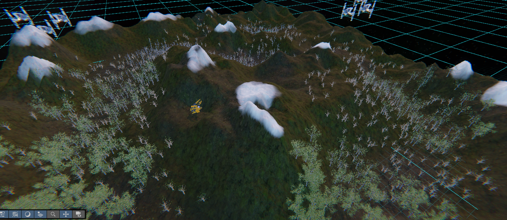
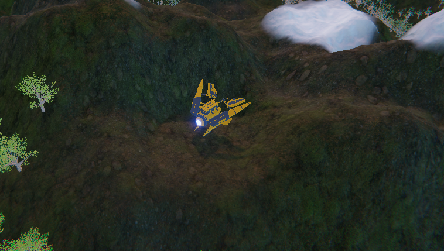
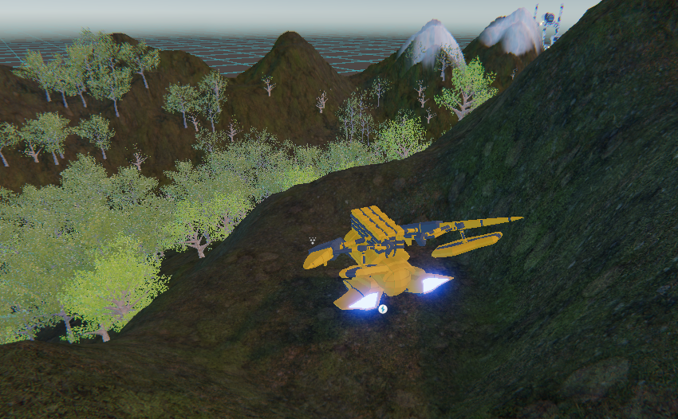
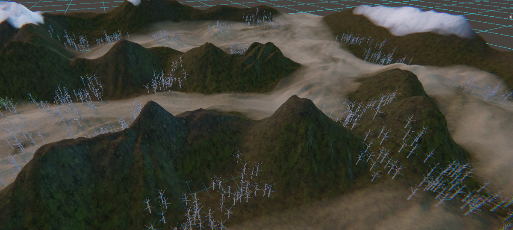
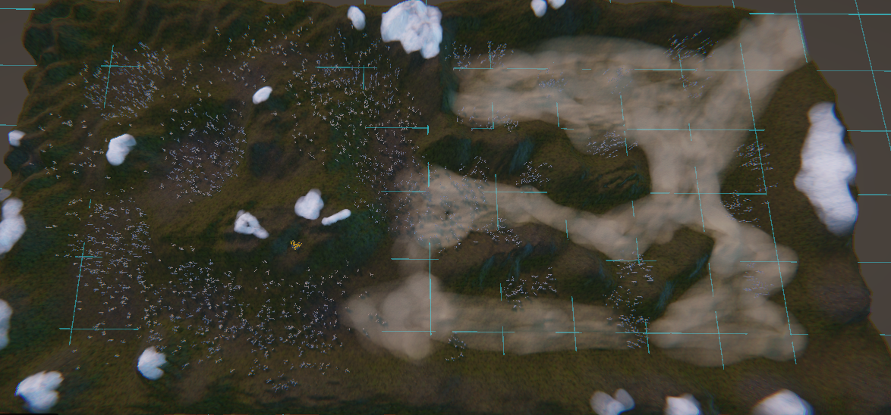
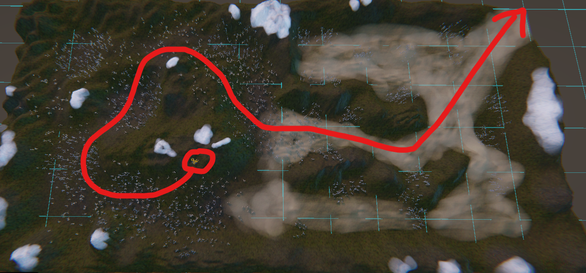

# Galaxy-Strike
Udemy Course - Galaxy Strike

Rail shooter

Take command of a ship and destroy enemies located across the landscape.

Controls:
---------
Move - WASD

Shoot - LMB

Bird's eye view of the first half of the rail shooter course.

Player ship

Player starting position

Second half of the course (desert/barren):

Overhead view of the whole course

Player ship course:

